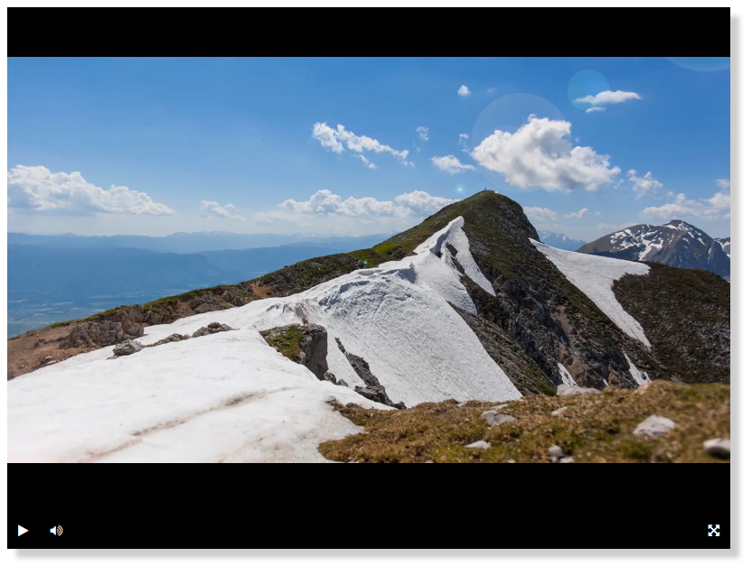

# Верстаем видеоплеер
## Прототип видеоплеера для Игоря Иванова. 

Видеоплеер построен на базе библиотеки [Playable](https://wix.github.io/playable/), код любезно предоставлен [Devman](https://github.com/devmanorg/video-player-jslib).

Реализованы кнопки управления Play, Pause, Mute, Full screen.

Пример прототипа плеера опубликован GitHub Pages по ссылке: 
[https://sam1808.github.io/Make-video-player/player/index.html](https://sam1808.github.io/Make-video-player/player/index.html)

## Как запустить плеер локально
Скачайте код: 
```
git clone https://github.com/Sam1808/Make-video-player.git
```
В репозитории представлены две папки `fonts` и `player`. Запустите двойным кликом файл `index.html` из папки `player`.
В браузере вы должны получить следующий результат:

